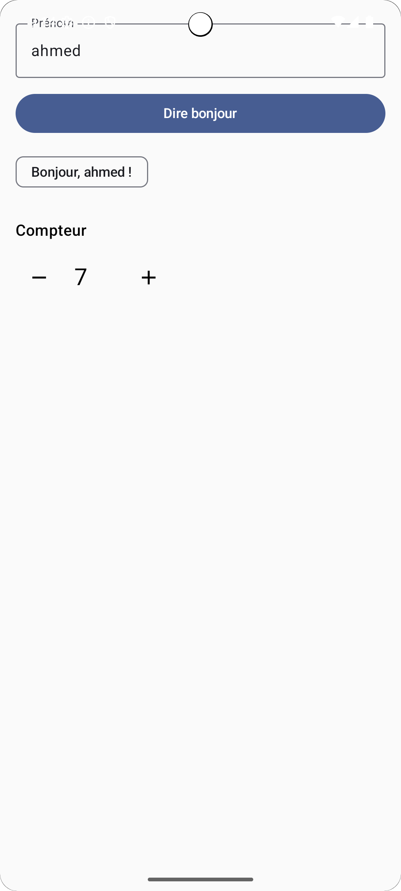
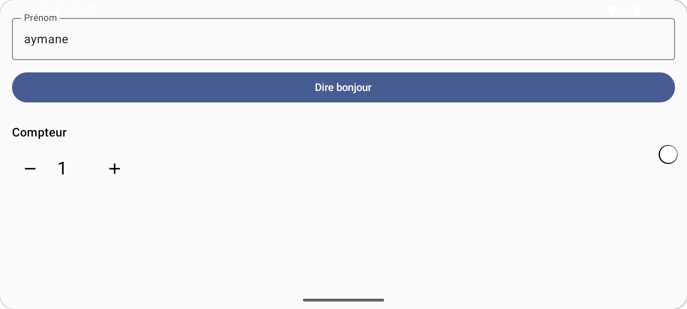

#  HelloConter

## 1) Generate the APK

### 🔹 Using Android Studio

1. Open your project in **Android Studio**.
2. Go to **Build → Build Bundle(s) / APK(s) → Build APK(s)**.
3. Wait until the build finishes.
4. The APK file will be generated at:

```
app/build/outputs/apk/debug/app-debug.apk
```

---

### 🔹 Using the command line (optional)

From the root of your project, run:

```bash
# macOS/Linux
./gradlew assembleDebug

# Windows
gradlew assembleDebug
```

The APK will be generated in the same location:

```
app/build/outputs/apk/debug/app-debug.apk
```

---

## 2) Install the APK

### 🔹 On a physical device

1. Copy the APK to your Android device.
2. Enable **installation from unknown sources** in the system settings.
3. Open the APK file and confirm installation.

### 🔹 Using ADB (Android Debug Bridge)

If you have ADB installed, run:

```bash
adb install -r app/build/outputs/apk/debug/app-debug.apk
```

* `-r` → replaces the previous installation if the app is already installed.

---

## 3) Run the Application

After installation, find the app icon (e.g. **HelloCounter**) on your device or emulator and open it.

---

## 🖼 Captures d’écran (to include in the livrable)

Insert screenshots of your app after installation:

* **Home screen**
  

* **Counter screen**
  


---
